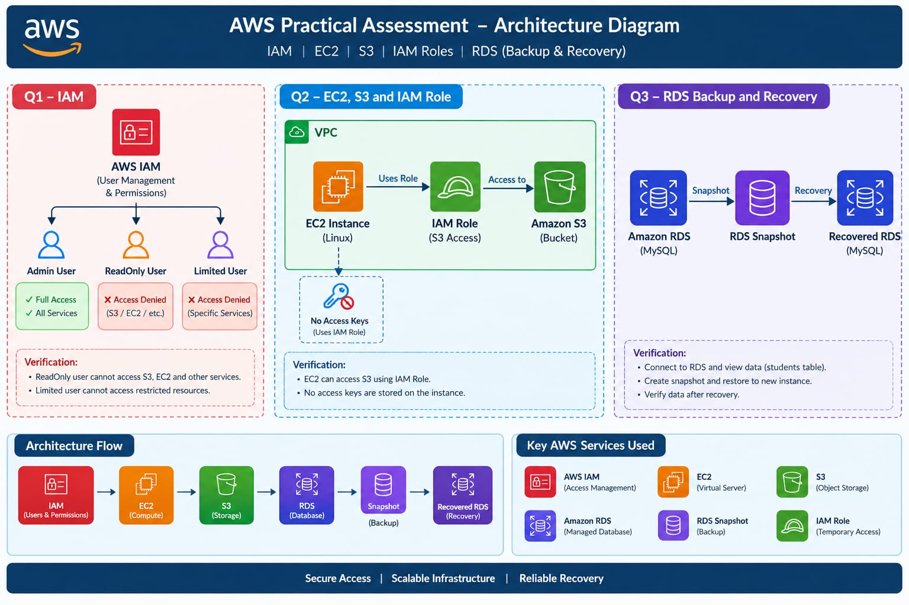
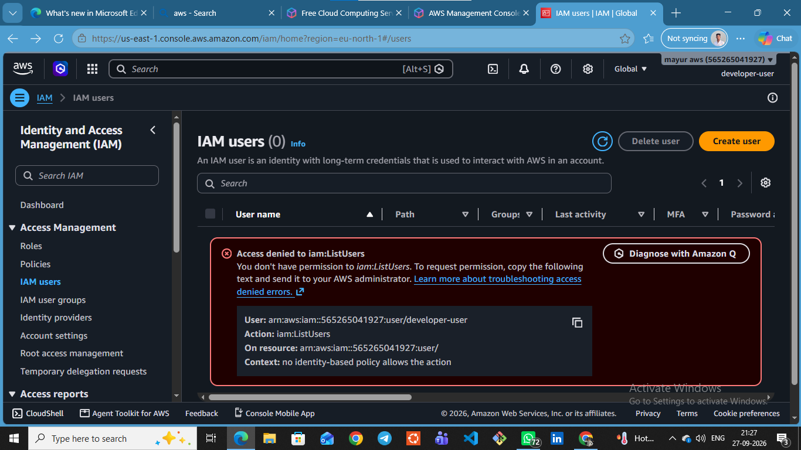

# AWS Cloud Practical Assessment

## 📌 Project Overview

This project demonstrates the practical implementation of **AWS Cloud services and security concepts** through three hands-on projects.

The assessment focuses on **AWS IAM access management, EC2 and S3 integration using IAM Roles, and Amazon RDS MySQL backup and recovery**. It demonstrates how AWS resources can be securely configured, managed, tested, and documented using the **AWS Management Console and AWS CLI**.

The project provides hands-on experience with **Identity and Access Management, cloud security, compute, object storage, managed databases, access control, backup, and recovery**.

---

## ☁️ AWS Services Used

- AWS IAM
- Amazon EC2
- Amazon S3
- IAM Roles
- Amazon RDS (MySQL)
- AWS CLI

---

## 🏗️ AWS Architecture Diagram

The architecture demonstrates the relationship between **IAM, EC2, S3, and Amazon RDS** and shows how secure access and data management are implemented within the AWS environment.

---

## 🔐 Project 1 – IAM Access Management

This project demonstrates the creation of an IAM-based access management environment.

### Key Implementation

- Create IAM users and groups
- Create Administrator, Developer, and Read-Only users
- Attach appropriate IAM policies
- Configure role-based permissions
- Test permitted and denied AWS operations
- Demonstrate the **Principle of Least Privilege**

---

## 🖥️ Project 2 – EC2 to S3 Access Using IAM Role

This project demonstrates secure access from an EC2 instance to an Amazon S3 bucket without storing AWS access keys on the server.

### Key Implementation

- Create an IAM role for EC2
- Attach S3 permissions to the IAM role
- Launch an EC2 instance with the IAM role
- Access the S3 bucket from EC2
- Perform S3 operations using AWS CLI
- Verify successful and secure S3 access

---

## 🗄️ Project 3 – RDS MySQL Backup & Recovery

This project demonstrates database backup and recovery using Amazon RDS for MySQL.

### Key Implementation

- Create an Amazon RDS MySQL database
- Configure automated backups
- Insert sample database records
- Create a manual DB snapshot
- Simulate data loss
- Restore the database from the snapshot
- Verify the recovered records

---

## 🧪 Testing & Verification

Each project includes practical testing to verify that the configured AWS resources and permissions are working as expected.

The documentation contains:

- AWS configuration screenshots
- IAM policy configurations
- EC2 and S3 access testing
- AWS CLI commands
- Database records
- Backup and snapshot details
- Recovery and verification results

---

## 🎯 Learning Outcomes

Through this practical assessment, I gained hands-on experience with:

- AWS Identity and Access Management
- IAM users, groups, roles, and policies
- EC2 instance management
- Secure S3 access
- IAM Role-based authentication
- Amazon RDS MySQL
- Database backup and recovery
- AWS CLI
- Cloud security best practices
- Least-privilege access control

---

## 📚 Conclusion

This project demonstrates practical knowledge of core AWS services and their real-world implementation. It helped strengthen my understanding of **AWS security, compute, storage, database management, access control, backup, and recovery**, while providing hands-on experience in managing cloud infrastructure.

---

## 🏗️ AWS Architecture Diagram



---

# 🔐 Q1 - IAM

Implemented AWS IAM security and access management.

### Access Denied



### Read Only Access Denied


### S3 Access Denied


---

# 🖥️ Q2 - EC2, S3 & IAM Role

Implemented EC2, S3 and IAM Role configuration.

### Admin Access


### S3 Access


### IAM Role Test


---

# 🗄️ Q3 - RDS Backup & Recovery

Implemented Amazon RDS with MariaDB database,
backup and recovery operations.

### MySQL Connection


### MySQL Student Database


### Recovery Data


---

## 🐧 Linux

Linux was used for:

- EC2 server administration
- SSH connection
- File management
- Permissions
- User management
- Database connectivity

---

## 🔧 Git & GitHub

Git and GitHub were used for version control and project management.

### Git Commands

```bash
git init
git status
git add .
git commit -m "AWS Cloud Practical Assessment"
git branch
git remote -v
git push
